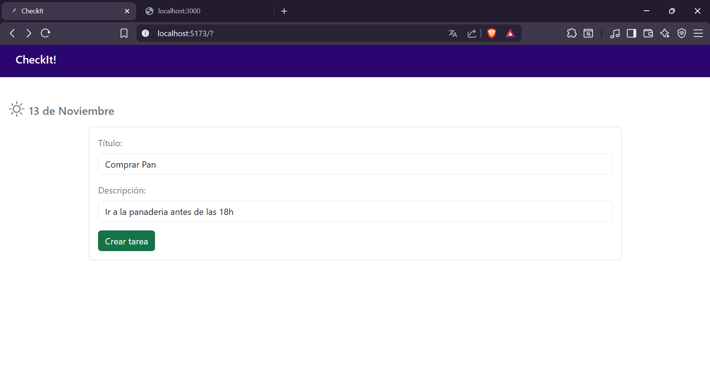
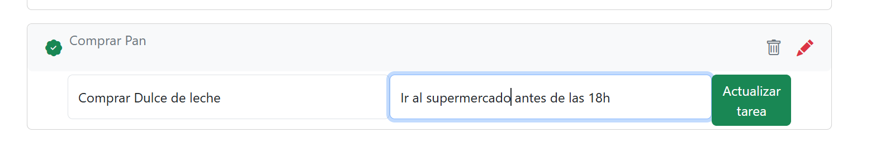
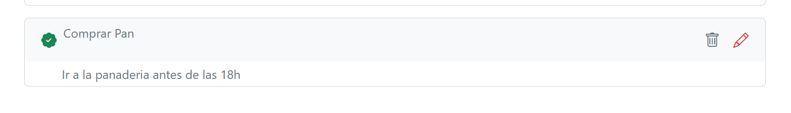

Proyecto ForIT Software Factory

## Desarrollado por Denisse Fernández

-------------------------------Descripción------------------------------------

Aplicación full-stack de gestión de tareas (To-Do) desarrollada para el challenge de ForIT Software Factory.
Permite crear, editar, marcar como completadas y eliminar tareas.
El frontend y el backend se comunican mediante el puerto http://localhost:3001
El almacenamiento es local mediante un array en memoria, por lo que al apagar el servidor backend los datos se pierden.

-------------------------------Estructura del proyecto--------------------

El proyecto está dividido en dos partes:
/backend
/frontend
Es necesario iniciar tanto el backend como el frontend para que la aplicación funcione correctamente.
-------------------------------Instrucciones para ejecutar la aplicación localmente--------------------

1. Clonar el repositorio
   git clone <URL_DEL_REPOSITORIO>
   cd proyecto
2. Instalar dependencias

cd backend
npm install

cd ../frontend
npm install 3. Ejecutar en ambos servidores
npm run dev

----------------------------------Nota final------------------------------------------
Fue un gusto realizar este proyecto muchas gracias por verlo!

-------------------------------Screenshots-------------------

## Screenshots

### Pantalla principal

### Crear una tarea

### Edición de tarea

### Tareas completadas

